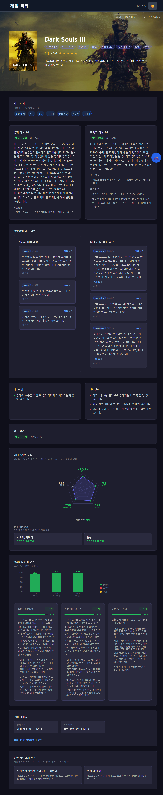
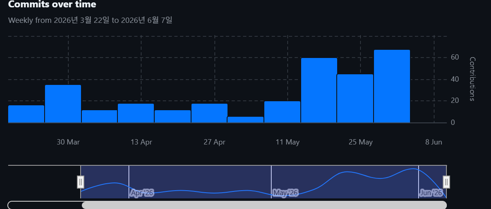

# 🎬 최종 시연 & 평가 자료

> 발표 평가 기준(시연 · 기술 챌린지 · 품질 · 개발 프로세스 · 달성도 · 향후)을 한곳에 정리한 문서입니다. `<!-- TODO -->` 표시는 발표 전 직접 채워 주세요.
> 프로젝트 개요·기술 설명은 [../README.md](../README.md), 아키텍처 상세는 [ARCHITECTURE.md](ARCHITECTURE.md)를 참고하세요.

## 1. 최종 시연 (라이브 데모)

- **라이브 데모(메인)**: <https://formerly-integral-regard-sara.trycloudflare.com> — Cloudflare Tunnel로 공개된 실제 서비스

**게임 목록 화면**

📱 상세 페이지 전체 화면 캡처 (클릭해서 펼치기)

## 2. 핵심 기술 챌린지 (STAR)

> 이 프로젝트의 본질은 **Map-Reduce 요약 파이프라인의 품질**입니다. "LLM에 리뷰를 넣어 요약"하는 것 자체는 쉽지만, **환각 없이 근거에 묶이고 톤·점수가 정확한** 결과를 내는 데 대부분의 노력이 들어갔고, 그 과정이 커밋 이력과 60개 이상의 회귀 테스트(`ai-pipeline/test_map_reduce_quality.py`)에 그대로 남아 있습니다.

**🔑 챌린지 A1 (핵심) — 근거 무결성 & 환각 차단**
- **Situation**: 리뷰를 그대로 LLM에 요약시키면 대상이 아닌 **다른 게임 이야기를 지어내거나**(환각), 근거 없는 항목을 만들어내고, Map LLM이 매번 **형식이 다르거나 깨진 JSON**을 뱉어 파이프라인이 멈춤.
- **Task**: 사용자에게 보이는 모든 문장·점수가 **실제 리뷰 `review_id`에 묶이고**, LLM 출력 변덕에도 파이프라인이 끊기지 않게.
- **Action**:
  - **근거 강제 / 환각 차단**: Map evidence는 청크 내 실제 리뷰에서만 추출, Reduce 프롬프트에 **대상 게임 정체성을 고정**(`pins_target_game_identity`), 다른 게임에 묶인 grounding 용어 제거, aspect·점수 보정(delta)은 **인용된 `review_id` 검증**을 통과해야만 반영.
  - **LLM JSON 복구 레이어**: Map이 `id`만·배열만·필드 누락 등 다양하게 깨뜨려도 `review_id`·candidate 매칭으로 스키마를 재구성해 파이프라인이 멈추지 않음(`*_repairs_*` 다수 테스트).
- **Result**: 노출되는 한줄평·장단점·키워드·추천 대상·항목 점수가 **모두 인용 근거**를 가지며, LLM이 깨진 JSON을 내도 파이프라인이 살아남음. "단순 AI 요약"과 구별되는 제품의 핵심 가치.

**🔑 챌린지 A2 (핵심) — 공개 한국어 문장의 톤·표현 정확성**
- **Situation**: 근거에 묶더라도 LLM은 "어렵지만 재밌다"를 **단점으로 오분류**하고, 근거 없는 미사여구·일반론을 내며, 수사적 불만을 장점으로 올리고, 한국어 조사·슬랭이 어색하며, **스포일러**가 그대로 노출됨.
- **Task**: 보이는 한국어 문장이 **감성이 정확하고 깔끔하며 스포일러가 없게**.
- **Action** (각 항목을 회귀 테스트로 고정 — `test_map_reduce_quality.py` 60+ 케이스):
  - **극성 = 만족도(특성 강도 아님)**: "어렵지만 재밌다"=긍정으로 처리하고 난이도 언급을 자동 약점으로 보지 않음, aspect별 polarity를 분리(`gameplay` 부당 약점 보정).
  - **톤 편향 교정**: 한줄평 긍정 편향 완화, 수사적 불만을 장점으로 승격 금지, 부정 표현을 pros로 올리지 않음, mixed 근거를 장·단점에 적절히 배치.
  - **모호·일반론 컷 + 룰 기반 정제**: vague 문장·플레이어 일반화 제거, 한국어 조사·슬랭·비속어 정규화, `summary_rules.json` 규칙을 generic fallback보다 우선 적용.
  - **스포일러 마스킹**: evidence를 `public_detail`/`spoiler_risk`로 분리해 공개 문장에서 스포일러를 가림.
- **Result**: 장단점이 실제 감성과 일치하고, 미사여구·일반론·어색한 한국어·스포일러가 **회귀 테스트로 차단**됨.

**🔑 챌린지 B (핵심) — Reduce 신뢰성: 결정론 점수 + 무료 한도 운영**
- **Situation**: ⒜ 리뷰 수백~수천 개를 한 번에 LLM에 넣으면 토큰 비용·레이트리밋이 폭증, ⒝ LLM이 점수를 자유 산출하면 run마다 흔들림, ⒞ Groq 무료 한도(RPM/TPM/일일 TPD)·간헐 실패로 reduce가 깨짐.
- **Task**: 비용 한도 안에서 **재현 가능하고 근거 있는** 점수, 그리고 실패에 견디는 운영.
- **Action**: ① 비용 큰 **Map은 로컬 GPU**, 품질 중요한 **Reduce는 Groq**로 이원화 + Map 결과 Redis 캐시·payload 보존(`--from-payload`로 Map 없이 재실행). ② Reduce를 기능별 4회(user/critic/playtime/final)로 분리. ③ **점수 앵커를 공식 통계(Steam 추천률·Metacritic 평균)에 고정**하고 LLM은 인용 검증된 보정값(delta)만 제안 — 최종 점수는 코드가 결정. ④ 유저/종합/평론가 점수를 **서로 다른 앵커·근거로 독립 산출**, aspect baseline 표본 80→160으로 점수 흔들림 완화. ⑤ 429 `retry-after` 존중·일일 한도 즉시 실패·키 로테이션, **reduce 실패 시 기존 요약 덮어쓰기 방지**.
- **Result**: 같은 입력에 같은 점수(결정론), 점수↔근거 출처 일치, 무료 한도 초과·간헐 실패에도 기존 요약 보존.

**챌린지 C — 항목별 강·약점 판정 (반복 재설계)**
- **S/T**: 항목 강·약점을 샘플 `polarity_mix`·게임-내-상대로 판정하니 조작감·최적화가 거짓 약점, 명작 강점(스토리 183건·94%)은 누락.
- **A**: 상대 위치 필수화 → `mention_share` 제외 → prior 재중심화로도 안 풀려, **9개 대표 게임 실제 리뷰로 진단** 후 **전체 리뷰 언급량+긍정률(`category_frequency`)** 기반으로 전환(강점 ≥30·≥92% / 약점 ≥12·≤78%), 레이더는 점수 9밴드로 분리.
- **R**: BG3 최적화·Witcher 3 조작감 등 실제 약점 포착, 명작 강점 노출. ([ARCHITECTURE §5-1-1](ARCHITECTURE.md))

**챌린지 D — 증분 요약이 기존 양질 요약을 덮는 문제**
- **S/T**: 증분(모드 A)은 Map이 신규 배치만 보고 본문을 재생성 → 소량·저품질 신규가 양질 요약을 덮고 점수가 드리프트.
- **A**: 최소 신규 건수 미달 시 스킵·커서 미전진(누적), 직전 근거를 Redis로 carry-forward 병합, 빈약 결과 보존, 모드 A·B 공통 공식 앵커.
- **R**: 저품질 배치가 요약을 덮지 못하고 증분/전체 점수 기준이 일치.

**챌린지 E — 플레이타임 구간 샘플링의 편향**
- **S/T**: 고정 가중치가 1시간·1000시간을 비슷하게 취급, 수천 시간 이상치가 샘플을 점령, 게임별 분포 무시.
- **A**: p33/p66 백분위 동적 버킷, 500h 이상치 캡, 버킷 차등 가중(균형 잡힌 mid 0.7 최고), 버킷 균형 샘플링, 표본 부족 구간은 "데이터 부족"으로 정직 노출.
- **R**: 게임마다 적응적 3등분, 극단값에 흔들리지 않음. ([playtime_improvement.md](playtime_improvement.md))

## 3. 제품 품질 증명

**외부 표준 지표(RAGAS faithfulness)** — 저희는 최종 요약이 실제 리뷰 근거에 얼마나 충실한지를 확인하기 위해 RAGAS의 `faithfulness` 지표를 사용했습니다. 이 지표는 요약문 안의 주장들을 쪼개서, 각 주장이 함께 제공된 근거 문맥으로 뒷받침되는지 평가합니다. 이 프로젝트에서는 이미 생성되어 있던 100개 게임의 최종 요약을 대상으로 삼고, Reduce 단계가 실제로 참고한 `evidence_items`와 `representative_quotes`를 근거 문맥으로 넣었습니다. 이 근거 문맥은 새로 만든 평가용 데이터가 아니라, Map 단계가 원본 Steam/Metacritic 리뷰에서 추출한 `{review_id, aspect, polarity, detail}` 단위 근거와 대표 인용을 Reduce 입력 payload에 저장해 둔 것입니다. 평가 시에는 `ai-pipeline/artifacts/reduce_payloads/keep/game_{id}_*.json`의 `grouped_summaries[*].evidence_items`와 `representative_quotes`를 다시 읽어 RAGAS context로 구성했습니다. 즉, "요약이 그럴듯한가"가 아니라 "요약의 문장이 실제 리뷰 근거에 묶여 있는가"를 외부 평가 모델로 검증한 것입니다. 채점 judge로는 요약을 생성한 모델이 아니라 **별개의 독립 모델(Google Gemini 3.l flash lite)**을 사용해 자기채점 편향을 피했습니다.

평가 결과, 100개 게임 모두 유효하게 측정되었고 평균 `faithfulness`는 **0.931**, 중앙값은 **1.000**이었습니다. 100개 중 90개가 0.8 이상, 97개가 0.7 이상을 기록했기 때문에, 대부분의 최종 요약은 실제 Reduce 입력 근거에 강하게 연결되어 있다고 해석할 수 있습니다. 다시 말해 사용자가 보는 한줄평과 장단점이 리뷰에 없는 내용을 임의로 만들어낸 것이 아니라, 저장된 리뷰 근거에서 설명 가능한 문장으로 구성되어 있다는 점을 수치로 확인했습니다.

물론 모든 결과가 완벽하다는 뜻은 아닙니다. 최저 점수는 0.625였고, `Death Stranding` 0.625, `Balatro` 0.636, `A Plague Tale: Innocence` 0.667처럼 낮게 나온 케이스도 있었습니다. 이 케이스들은 자동 평가에서 드러난 수동 검토 대상입니다. 그래서 이 결과는 "품질 문제가 전혀 없다"는 주장보다는, 전체 100개 게임 기준으로 요약의 근거 충실도가 높은 편이며, 동시에 개선해야 할 하위 사례도 식별할 수 있다는 증거로 보는 것이 적절합니다. 행별 평가 결과는 [../ai-pipeline/eval_ragas_reduce_result.csv](../ai-pipeline/eval_ragas_reduce_result.csv)에 남겨 두었습니다.

**회귀 테스트로 고정된 품질 게이트** — RAGAS가 결과물의 근거 충실도를 외부에서 검증한다면, 그 품질을 만들어 내는 규칙은 코드 안에 약 100개의 회귀 테스트로 박제돼 있습니다(`ai-pipeline/test_map_reduce_quality.py`의 82개를 비롯해 aspect·one-liner·grounding 테스트).

이 테스트들을 작성한 의도는 LLM 출력의 비결정성에 있습니다. 한 가지 먼저 짚어 둘 점은, 이 테스트들이 **LLM을 실제로 호출하지 않는다**는 것입니다. LLM이 내는 텍스트는 같은 입력에도 매번 달라 직접 단정할 수 없으므로, LLM이 낼 법한 출력(특히 깨진 JSON 같은 실패 사례)을 **합성 입력으로 직접 만들어 넣고**, 그것을 받아 처리하는 복구·정제·검증 코드가 올바른 결과를 내는지 확인합니다. 즉 매번 달라지는 LLM의 출력이 아니라, 그 출력을 안전하게 만드는 결정론 코드 자체를 검증하는 방식입니다(예: 일부러 잘라 둔 JSON 문자열을 복구 함수에 넣어 `review_id`가 제대로 복원되는지 확인). 같은 코드라도 프롬프트나 모델, 입력이 조금만 달라지면 한 번 고쳤던 품질 문제가 다시 새어 나오기 때문에, 개발 과정에서 발견한 결함을 고치는 순간마다 곧바로 테스트로 박제했습니다. 각 테스트는 "이런 입력에서 이런 잘못된 출력이 나오면 안 된다"를 코드로 고정한 것이고, 그래서 회귀 테스트 모음 자체가 이 파이프라인이 그동안 배운 품질 교훈의 기록이 됩니다. 덕분에 프롬프트를 손보거나 모델을 교체했을 때 과거의 실수가 되살아나면, 회귀 테스트를 돌리는 순간 그 변경이 곧바로 실패로 드러납니다(로컬 `pytest` 실행 기준).

이 테스트들이 실제로 막아 주는 것은 §2에서 다룬 품질 결함들입니다. 환각을 차단하기 위해, 요약이 대상이 아닌 다른 게임을 이야기하거나 다른 게임에 묶인 근거 용어를 끌어오는 경우를 테스트가 잡아내는데, 이것이 RAGAS faithfulness가 높게 나온 근본적인 이유이기도 합니다. Map 단계의 LLM이 어떤 식으로 JSON을 깨뜨리든 — id만 내거나, 배열만 내거나, 필드를 누락하거나 — 스키마를 재구성하도록 한 복구 로직은 별도의 테스트군이 지키고 있어, 모델이 형식을 어겨도 파이프라인이 멈추지 않습니다. 또한 "어렵지만 재밌다" 같은 문장이 단점으로 오분류되지 않도록 극성을 특성 강도가 아닌 만족도 기준으로 해석하는 규칙을 고정하고, 부정 표현이 장점으로 올라가거나 수사적 불만이 호평으로 둔갑하는 톤 오류를 막으며, 근거 없는 일반론이나 어색한 한국어 문장은 정제 테스트가 공개 출력에서 걷어냅니다.

정리하면 두 검증은 서로 다른 질문에 답하며 상호보완합니다. **RAGAS는 *실제로 생성된 요약*이 리뷰 근거에 충실한지** — 즉 LLM이 만들어 낸 결과물의 품질을 묻고, **회귀 테스트는 *LLM이 어떤 출력을 내든 그것을 안전하게 만드는 코드*가 정확하며** 이후의 코드 변경에도 그 품질이 유지되는지를 묻습니다. LLM의 생성 품질(RAGAS)과 그것을 받아 처리하는 코드의 정확성(회귀 테스트)을 함께 확인해야, "결과물도 근거에 묶여 있고, 그렇게 만드는 코드도 맞다"가 성립합니다.

- **성능 최적화 (코드 반영)**:
  - 게임 카탈로그 Redis 5분 캐시 — 매 요청 DB 풀 조회 제거
  - IP 기반 rate limiting(분당 10회) + `GroqKeyRotator` 키 로테이션(429 자동 전환)
  - 가격·여론 스냅샷 사전 적재 → 사용자 요청이 외부 API 레이트리밋에 미노출
  - 증분 커서(`game_summary_cursor`)로 신규 리뷰만 재요약
- **요약 정확성 검증**: 9개 대표 게임의 실제 리뷰와 대조해 강·약점 라벨이 평판과 일치함을 확인(BG3 최적화, Witcher 3 조작감, Starfield 가성비 등).

## 4. 개발 프로세스 증명

- **협업 지표 (git 기준)**: 총 커밋 **326개**, 기여자 **5명**(+ 배포 서버 계정 `capstone7`). main에 직접 push하지 않고 **기능 브랜치 → 통합 브랜치 → main**의 분기 개발을 거쳤습니다(`feature/cloud-deploy`·`feature/ai-chatbot`·`feat/evidence-grounded-scoring`·`feature/review-restructure`·`feature/groq-reduce-test` 등).
  - 기여자: [GitHub Contributors](https://github.com/euden112/make-review-web/graphs/contributors) · 활동 추이: [Commit Activity](https://github.com/euden112/make-review-web/graphs/commit-activity)

  

- **PR 기반 통합**: GitHub Pull Request **#2·#3·#4·#6·#7·#8** 머지를 포함해 **merge 커밋 20개**로 브랜치를 통합했습니다(예: PR #7 `feature/ai-chatbot`, PR #8 `integration/feat-cloud`). 코드 리뷰 수 등 세부는 GitHub Insights에서 확인할 수 있습니다.
- **테스트 주도 품질 강화 (로컬 검증)**: 품질 결함을 고칠 때마다 회귀 테스트를 함께 추가해, 테스트 파일이 **28개 커밋에 걸쳐** 누적됐습니다(`git log -- ai-pipeline/test_*.py`). 현재 `ai-pipeline/test_*.py`(`test_map_reduce_quality.py` 82개 등)와 `backend/tests/`를 합쳐 **102개 테스트가 로컬 `pytest`로 모두 통과**(`102 passed in 3.46s`)하고, frontend는 ESLint를 통과(`No issues found`)합니다. *별도의 CI 자동 게이트는 도입하지 않았으며, 검증은 로컬 실행 기준입니다(향후 과제).*
- **스프린트 진행**: DB 스키마 변경이 **Sprint 2~6** 단위로 번호 매겨져 누적됐습니다(`database/03_migration_sprint2.sql` … `10_migration_sprint6_fixes.sql`). 스프린트 단위로 기능·스키마가 확장된 기록입니다.

## 5. 달성도 증명

학기 초 Product Backlog(`docs/학기초계획/`)에 정의한 **사용자 스토리 15개** 대비 현재 구현 상태입니다. ✅ 완전 달성 · ◐ 부분 달성 · ✗ 미착수로 표기합니다.

| 사용자 스토리 | 계획 | 현재 | 근거 |
|---|---|---|---|
| 리뷰 데이터 수집 파이프라인 (Steam·Metacritic) | Sprint 1 | ✅ | `crawling/steam`·`crawling/metacritic` → `external_reviews` |
| 수집 데이터 정제 및 DB 저장 | Sprint 1 | ✅ | 전처리·`normalized_score_100`·중복 upsert |
| **AI 기반 리뷰 핵심 요약 생성** (장단점·한 줄 평) | Sprint 2 | ✅ | Map-Reduce 파이프라인, 긍·부정 키워드 3+·`one_liner` (프로젝트 핵심) |
| 게임 목록 및 상세 페이지 | Sprint 2 | ✅ | `GameListPage`(그리드)·`GameDetailPage`(`/games/:id`) |
| 다국어 리뷰 자동 번역 | Sprint 3 | ✅ | `/api/v1/translate/batch`, 원문/번역 토글 |
| 게임명 통합 검색 및 자동 완성 | Sprint 3 | ◐ | 제목 검색은 동작, 자동완성 드롭다운은 미구현 |
| 상세 조건 필터링 탐색 | Sprint 3 | ◐ | 장르 필터·평점 정렬·"결과 없음" 안내는 동작, 메타크리틱 점수 임계 토글은 미구현 |
| 리뷰 출처 및 신뢰도(플레이타임) 배지 | Sprint 3 | ◐ | 플레이타임을 **집계 분석**("플레이타임별 여론", Sprint 4)으로 활용, 개별 리뷰 카드 배지는 미구현 |
| 텍스트 위주(무평점) 리뷰 자동 요약 | Backlog | ◐ | 무평점 Metacritic critic 리뷰도 요약에 반영, 개별 리뷰 1~2줄 요약 UI는 미구현 |
| 사용자 취향 기반 추천 | Backlog | ◐ | **AI 추천 챗봇**으로 형태 변경 달성(선호/비선호 게임 입력 → DB 게임 추천), 마이페이지 장르 저장식 개인화는 미구현 |
| 인기/신작 게임 주기적 자동 동기화 | Backlog | ◐ | 일일 스케줄러(가격→증분 크롤→AI 배치) 동작, 신작 자동 발굴·Insert는 미구현 |
| 리뷰 필터 및 정렬 (별점/출처) | Backlog | ◐ | 게임 목록 정렬은 동작, 리뷰 단위 출처별 필터는 미구현 |
| 플랫폼 내 자체 유저 리뷰 작성 | Backlog | ✗ | 회원/로그인 기능 미도입 |
| 실시간 게임 인기 차트 | Backlog | ✗ | 미착수 |
| 검색 기반 게임 정보 실시간 등록 | Backlog | ✗ | DB 미보유 게임 즉시 등록 미구현 |

**요약**: 완전 5 · 부분 7 · 미달 3. **학기 초 우선순위(Sprint 1~3, High/Medium)로 잡았던 핵심 가치사슬 — 수집 → 정제·적재 → AI 요약 → 다국어·검색·필터 서빙 — 은 전부 동작**합니다. 미달 3건은 모두 학기 초에도 후순위(Backlog·Low)로 분류했던 부가 기능입니다.

계획에 없었으나 추가로 구현한 것: **AI 추천 챗봇**, **플레이타임별 여론 분석**(Sprint 4), **게임 비교 페이지**, 구매 신호·평가 분기 등 부가 분석, **RAGAS 기반 외부 품질 평가**(§3).

- **배포 증명**: Docker Compose 전 스택(postgres · redis · backend · scheduler · frontend) + Cloudflare Tunnel 공개. **크롤 → 적재 → Map-Reduce 요약 → 프론트 서빙** 전 경로가 실서비스로 동작([../README.md](../README.md) 구현 상태 참고).

## 6. 향후 발전 / 아쉬운 점

### 아쉬운 점

- **리뷰를 전부 쓰지 못한다**: 인기작은 리뷰가 수천 개씩 달리지만, 모델 컨텍스트와 토큰 한도 때문에 한 게임당 200개 정도만 골라 요약에 넣는다. 요약은 어디까지나 이렇게 추린 표본 기준이라는 한계가 있다.
- **고르는 기준의 쏠림**: 도움됨 수와 플레이타임이 높은 리뷰를 우선하다 보니, 짧게 핵심만 적은 리뷰나 갓 올라온 리뷰는 표본에서 자연스럽게 밀린다.
- **언어를 한국어·영어로 제한**: 로컬 Map 모델이 작아 다른 언어는 항목 추출·감성 분류가 자주 어긋나, 모델이 안정적으로 처리하는 두 언어만 남겼다. 품질을 지키려는 선택이지만 일본·중국 등 다른 언어권 여론은 통째로 못 본다.
- **짧은 리뷰까지 걸러짐**: 스팸을 거르려고 길이 하한을 두다 보니, 멀쩡한 한 줄 평도 함께 탈락한다. 위의 언어 제한과 같은 맥락(소형 모델 한계 대응)이다.
- **신뢰도 검사가 사후에만 있음**: 요약 품질을 RAGAS로 재긴 하지만, 이미 만들어진 요약을 나중에 채점하는 방식이다. 만드는 순간에 근거 충실도를 확인해 이상하면 막거나 다시 만드는 장치가 없어, 품질 낮은 요약이 그대로 나갈 가능성이 남는다.

여기까지는 요약 품질 쪽 한계이고, 기능 범위에서도 학기 초에 계획했다가 넣지 못한 것들이 있다.

- **DB에 없는 게임은 즉석에서 못 본다**: 검색했을 때 DB에 없는 게임을 외부 API로 그 자리에서 가져와 등록하는 기능을 계획했지만 끝내 못 넣었다. 지금은 미리 크롤링해 둔 게임만 볼 수 있어서, 마이너한 게임을 찾으면 빈손으로 돌아간다.
- **신작·인기작 자동 편입이 약하다**: 일일 스케줄러가 기존 게임의 리뷰·가격은 갱신하지만, 스팀 인기작이나 신작을 스스로 찾아 카탈로그에 새로 추가하지는 못한다. 새 게임은 사실상 수동으로 넣어야 한다.
- **로그인·자체 리뷰가 빠졌다**: 회원 기능이 없어, 사용자가 직접 별점·리뷰를 남기거나 자기 취향이 누적되는 개인화 추천 같은 흐름은 들어가지 못했다(추천은 챗봇으로 매번 입력받는 형태로만 구현).

### 향후 발전

품질 쪽으로는
- 지금은 따로 돌리는 RAGAS 신뢰도 검사를 요약 생성 직후에 바로 끼워 넣어서, 근거 충실도가 기준에 못 미치면 자동으로 다시 만들거나 신뢰도를 표시해 주는 쪽으로 가는 게 다음 목표다.
- 토큰 여유가 생기면 표본 상한을 올리거나, 1차로 요약한 뒤 빠진 리뷰만 다시 한 번 돌리는 식으로 표본을 전수에 가깝게 늘리고 싶다.
- 한국어·영어 말고 다른 언어권 리뷰까지 통합 관점에 넣는 것도 과제로 남아 있다.

기능 쪽으로는
- 검색했을 때 DB에 없는 게임이면 그 자리에서 스팀·메타크리틱을 찔러 등록하고 바로 요약까지 돌리는 "온디맨드 등록"을 붙이고 싶다. 카탈로그 의존도를 없애는 가장 큰 숙제다.
- 스케줄러가 기존 게임 갱신에 더해 인기작·신작을 자동으로 잡아 카탈로그를 스스로 키우도록 확장.
- 로그인과 자체 리뷰·취향 누적 기반 개인화 추천을 얹어, 사용자 데이터까지 요약·추천에 반영.
